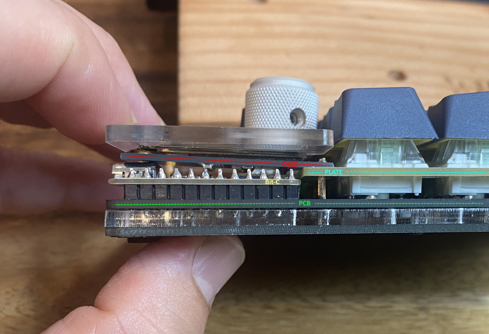
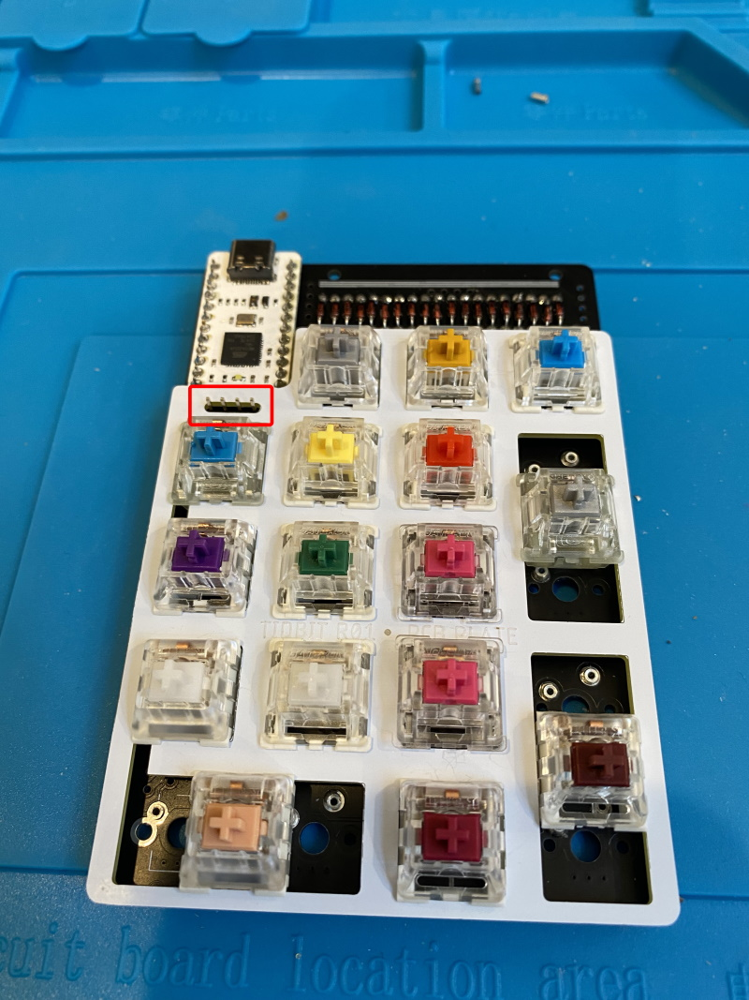
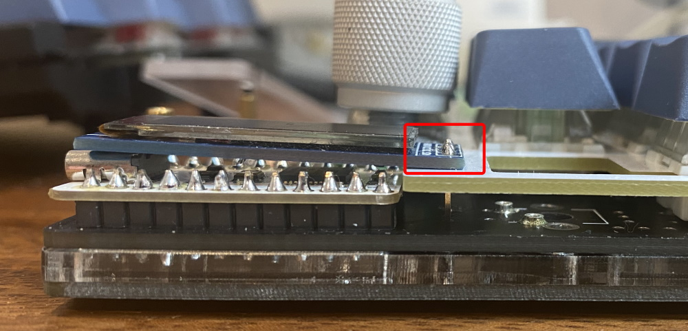
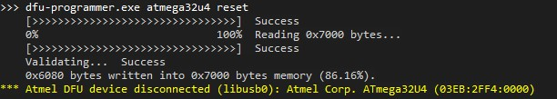

# SSD1306 OLED Install Guide

If you purchased the [Nullbits OLED](https://www.amazon.com/Display-Mechanical-Keyboards-Arduino-3-3V-5V/dp/B08KLHD2Z7), or a SSD1306 OLED, follow this guide to install it on your Nibble or Tidbit.

## For Tidbit

| Instructions  |  |
| ------------- | ------------- |
| 1. Solder 4 header pins with their short ends into the marked sockets on the Tidbit PCB. |  |
| 2. [OPTIONAL] If building with plate, the oled must be installed *above the plate*, so install hotswap / mill-max sockets that the plate will cover before proceeding. | | 
| 3. When the plate is aligned correctly, the OLED header pins will be sticking out of the plate a little bit.| |
| 4. Insert the OLED on the header pins such that the far end rests on the USB-C port. Use tape to hold it in place and ensure it is horizontal, then solder the OLED. Be careful not to damage the OLED while soldering. |  | 
| 6. Download and flash the latest [OLED keymap firmware](https://github.com/nullbitsco/firmware/releases/tag/latest) for the Tidbit (flashing instructions can be found [here](https://github.com/nullbitsco/docs/blob/main/firmware/firmware_flashing.md)). ||  |
| 7. If installed correctly, the OLED will show the Nullbits/Tidbit logo when plugged in. |  |

## For Nibble
Coming soon!
